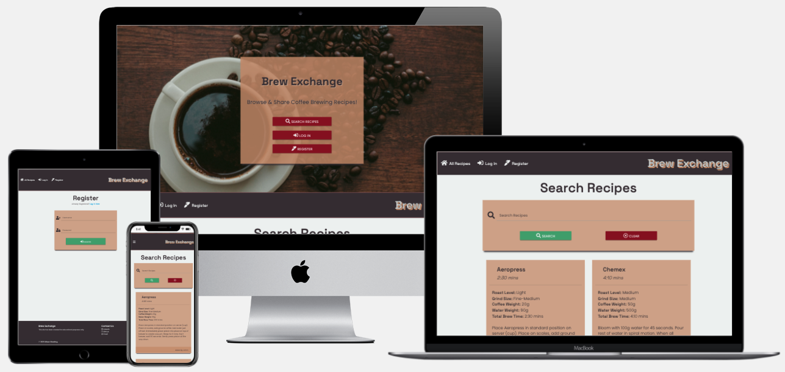

<h1 align="center">Brew Exchange</h1>

[View the deployed site here.](https://ms3-brew-exchange.herokuapp.com/)

Brew Exchange is a website where users can share their coffee recipes with the specialty coffee community, and can access recipes from other members of the community. This website was created for submission as my Milestone Project 3 as part of the Diploma in Full Stack Software Development course with Code Institute. 

 
## User Experience (UX)

With a large variety of brewing equipment, coffee varieties, and brewing methods, users can search for recipes that suit the coffee or brewing equipment that they have. This site advances the user's goals by providing CRUD functionality to the coffee recipes database. It advances the site owner's goals by being a regular user of the site themselves.

The User Experience for this site was planned & developed using the [5 Planes of UX Design](https://medium.com/designcentered/ux-design-5-planes-method-b1b1d6587c05): Strategy, Scope, Structure, Skeleton, Surface.

### Strategy
#### User Stories

- As a first-time visitor, I want to:
    - See coffee recipes that other users have added.
    - Search for recipes by keywords.
    - Register an account to add my own recipes.

- As a returning visitor, I want to:
    - See coffee recipes added by other users.
    - Search for recipes by keyword.
    - Login to my account to see recipes I have added.
    - Edit recipes that I have added.
    - Delete recipes that I have added.
    - Contact the site owner/admin to request the addition of new brew methods.

- As the site owner, I want to:
    - Log in to my admin/superuser account.
    - Add brew method categories for users to choose from when creating recipes.
    - Delete brew method categories.
    - Edit or delete all recipes that have been added by any user on the site, to moderate the site's content.

### Scope
#### Existing Features

- **Hero Image with Lead Text:**
    - The hero image serves the purpose of providing users with an immediate visual cue for the theme of the site - coffee. The Lead Text and call to action buttons concisely explain the site's purpose & demonstrate it's functionality.
- **Search Functionality:**
    - Allows users to search for specific types of recipes by keyword - available to both authenticated and unauthenticated users.
- **Register:**
    - Users can create an account on the site, in order to contribute to the site by adding their own coffee brewing recipes. The user input is validated, a new "user" document in the site's database is created, and hashing is used for password security.
- **Login/Logout:**
    - Adds authentication for registered users, allowing them to access, edit and delete their own recipes. Allows users to logout by clearing the "session" cookie.
- **Profile:**
    - Provides functionality for registered & logged in users to see the recipes that they've added (if any), add more recipes, edit or delete their existing recipes.
- **Add Recipe:**
    - Provides functionality for authenticated users to add their own recipes via a form.
- **Edit Recipe:**
    - Provides functionality for authenticated users to edit recipes that they've added. Extra checks are in place here to ensure the current user matches the username of the user who created the recipe.
- **Delete Recipe:**
    - Provides functionality for authenticated users to delete recipes that they've added. Extra authentication steps are also in place in this feature to ensure that the current username matches that of the recipe's creator.
- **Admin/Superuser Registration:**
    - This feature allows the site admin to register an account with the username "admin", granting access to edit and delete all recipes on the site for moderation purposes. The "admin" superuser is also granted access to additional site functionality to manage the brew methods that users can choose from when adding or editing recipes.
- **Manage Brew Methods (ADMIN):**
    - This section of the site allows the admin to view a list of the currently added brew methods, along with corresponding images of each brew method.
- **Add Brew Methods (ADMIN):**
    - Provides a form where the site admin can add new brew methods, and upload an image of the brew method.
    - It was decided to only allow images to be added in the form of an existing URL - due to the limitations for image support in the chosen database technology (MongoDB), and the additional development work that would be required to implement a third party image-to-URL solution. Because of these limitations, it was also decided to limit the use of images to the site admin only, to avoid misuse of the feature.
- **Delete Brew Methods (ADMIN):**
    - Provides functionality for the site admin to remove brew methods from the site.
- **Contact Page:**
    - Allows all users, authenticated or unauthenticated, to contact the site admin - for example, to ask the admin to add a new brew method to the list of options available in the "Add Recipe" form.

#### Future Planned Features
- **Affiliate Links:**
    - Would allow users to purchase brewing equipment of coffee beans used in specific recipes via affiliate links. Would additionally provide the admin/site owner with a means to generate income from the site via commissions.
- **"Like" Buttons:**
    - Would provide users with the option to "Like" recipes that they enjoy, and would save those recipes to a list that would be accessible from the user's Profile page.
- **Image Upload for All Users:**
    - Would provide an option for users to upload their own images to the site, to demonstrate how they would brew a particular recipe.

### Structure
#### Flowchart
- Flowchart created using [Lucidchart](https://www.lucidchart.com): 
    [Flowchart PNG](/readme-assets/images/brew-exchange-flowchart.png)

### Skeleton
#### Wireframes
- Wireframes created using [Balsamiq](https://balsamiq.com/): 
    [Wireframes PDF](/readme-assets/brew-exchange-wireframes.pdf)

### Surface

- Color Scheme:
    - Chosen using [coolors.co](https://coolors.co/). This palette was chosen to provide colors that tie in with the coffee theme of the site, and provide complimentary colors that offer sufficient contrasts to work with for accessibility purposes: 
    

- Typography:
    - The [Space Grotesk](https://fonts.google.com/specimen/Space+Grotesk) font was chosen for the site's headers, and [Poppins](https://fonts.google.com/specimen/Poppins) was chosen for the site's main text.

- Images:
    - [Unsplash](https://unsplash.com/) was used to select the site's Hero Image 
    

## Technologies Used

### Tools
- [GitPod](https://www.gitpod.io/)
    - Used as the preferred IDE for development.
- [Git](https://git-scm.com/)
    - Used via the Gitpod terminal for version control, with regular commits, and to push to GitHub & Heroku.
- [GitHub](https://github.com/)
    - Used to store the site's code repository.
- [Heroku](https://www.heroku.com/)
    - Used to host the deployed site.
- [Lucidchart](https://www.lucidchart.com)
    - To create the site's structural flowchart.
- [Balsamiq](https://balsamiq.com/)
    - To create the site's wireframes.
- [Google Fonts](https://fonts.google.com/)
    - Used to import the site's fonts.

### Front-End Technologies
- [HTML5](https://developer.mozilla.org/en-US/docs/Glossary/HTML5)
- [CSS3](https://developer.mozilla.org/en-US/docs/Web/CSS)
- [JavaScript](https://developer.mozilla.org/en-US/docs/Web/JavaScript)
- [JQuery 3.6.0](https://jquery.com/)
    - Used as the primary JavaScript library.
- [Materialize 1.0.0](https://materializecss.com/)
    - Used as a responsive front-end framework.
- [EmailJS](https://www.emailjs.com/)
    - Used to send emails to the site owner from the contact form.

### Back-End Technologies
- [Python](https://www.python.org/)
- [Flask](https://flask.palletsprojects.com/en/2.0.x/)
    - Used with Python as the primary web microframework.
- [Jinja](https://jinja.palletsprojects.com/en/3.0.x/)
    - Used for creating templates with Flask.
- [Werkzeug](https://werkzeug.palletsprojects.com/en/2.0.x/)
    - Used for password hashing & authentication on the site.
- [MongoDB Atlas](https://www.mongodb.com/)
    - Used to store the site's database.
- [PyMongo](https://pypi.org/project/pymongo/)
    - Used to interact with the MongoDB database from Python.

## Testing

### Testing User Stories from User Experience (UX) Section

As a first-time visitor, I want to;
- See coffee recipes that other users have added:
    - On the landing page, the "Search Recipes" button is immediately visible.
    - After scrolling down the homepage, recipes added by other users are visible.
    - On all pages, the "All Recipes" button is visible in the Navbar.
    - Recipe cards on the "All Recipes" page cleanly display the recipe information.
- Search for recipes by keywords:
    - On the landing page, the "Search Recipes" button is immediately visible, and can be clicked to jump to the "Search" section of the page.
    - After scrolling down the landing page, the "Search" functionality is visible.
    - The search bar can be used to search for recipes via the input of a keyword & clicking the "Search" button.
    - Current search results can be cleared to re-populate all recipes by clicking the "Clear" button".
- Register an account to add my own recipes:
    - The "Register" button is immediately visible on the landing page.
    - On all pages, a "Register" button is visible in the Navbar.
    - On the "Register" page, users are prompted to register an account by creating a unique username and password via a registration form.
    - After registering an account, the user is logged in & redirected to their Profile, where the "Add Recipe" button is visible.

As a returning visitor, I want to:
- See coffee recipes added by other users:
    - On the landing page, the "Search Recipes" button is immediately visible.
    - After scrolling down the homepage, recipes added by other users are visible.
    - On all pages, the "All Recipes" button is visible in the Navbar.
    - Recipe cards on the "All Recipes" page cleanly display the recipe information.
- Search for recipes by keyword:
    - On the landing page, the "Search Recipes" button is immediately visible, and can be clicked to jump to the "Search" section of the page.
    - After scrolling down the landing page, the "Search" functionality is visible.
    - The search bar can be used to search for recipes via the input of a keyword & clicking the "Search" button.
    - Current search results can be cleared to re-populate all recipes by clicking the "Clear" button".
- Login to my account to see recipes I have added:
    - The "Log In" button is immediately visible on the landing page.
    - On all pages, a "Log In" button is visible in the Navbar.
    - On the Login page, users are prompted to log in to their account with their username and password.
    - After logging in, the user is redirected to their Profile, where all recipes that they have added are visible.
- Edit recipes that I have added:
    - On the user's Profile page, all recipes that they have added include an Edit icon, a button that opens the "Edit Recipe" page when clicked.
    - On the Edit Recipe page, a form is presented to the user, pre-filled with the current recipe information.
    - The user can edit the pre-filled information, and click the "Save" button. They are redirected to their profile, with a flash message confirming that the recipe has been updated.
    - On the All Recipes/Home page, a conditional check is implemented to populate the above described Edit button only on recipes that the current user has added.
- Delete recipes that I have added:
    - On the user's Profile page, all recipes that they have added include a Delete icon, a button that opens the "Delete Recipe" modal when clicked.
    - On the Delete Recipe modal, the user is presented with a message prompting them to confirm that they wish to delete the recipe.
    - The user can confirm that they want to delete the recipe by clicking the modal's "Delete" button. They are directed back to their Profile page, and a flash message is populated confirming that the recipe has been deleted.
    - On the All Recipes/Home page, a conditional check is implemented to populate the above described Delete button only on recipes that the current user has added.
- Contact the site owner/admin to request the addition of new brew methods:
    - On all site pages, the "Contact" link is visible in the site's Footer.
    - On the Add Recipe & Edit Recipe pages, a link to the Contact page is visible above the form elements. This prompts users to contact the site owner if they would like a brew method to be added to the list.

As the site owner, I want to:
- Login to my admin/superuser account:
    - On the Login page, if an admin account exists, the admin can log in to their admin/superuser account with the username "admin" & their existing password.
- Add brew method categories for users to choose from when creating recipes:
    - While logged in as the "admin" user, the "Manage Methods" button is visible on the landing page.
    - While logged in as the "admin" user, the "Manage Brew Methods" button is visible on all site pages in the Navbar.
    - On the Manage Brew Methods page, the admin is presented with a list of currently added brew methods from the MongoDB database. 
    - On the Manage Brew Methods page, the "Add Brew Method" button is immediately visible. When clicked, this button opens the "Add Brew Method" page.
    - On the Add Brew Method page, the admin is presented with a form which prompts them to enter the name of the brew method, and a URL for an image of the brew method.
    - After saving the brew method, the admin is redirected to the Manage Brew Methods page, with a flash message shown to confirm that the brew method has been added.
- Delete brew method categories:
    - On the Manage Brew Methods page, all brew method cards include a Delete icon, a button that opens the "Delete Brew Method" modal when clicked.
    - On the Delete Brew Method modal, the admin is presented with a message prompting them to confirm that they wish to delete the brew method.
    - The admin can confirm that they want to delete the brew method by clicking the modal's "Delete" button. They are directed back to the Manage Brew Methods page, with a flash message populated confirming that the brew method has been deleted.
- Edit or delete all recipes that have been added by any user on the site, to moderate the site's content:
    - On the All Recipes/Home page, a conditional check is in place to populate the edit and delete buttons on all recipes, if the current user is "admin".

### Manual Testing
#### All Pages
Manual testing was performed on the following elements that appear across all pages on the site, to ensure that all are working as expected;

- Navbar:
    - Clicking the site logo in the navbar correctly directs back to the site's home page.
    - All navigation links direct the user to the correct site page for each link.
    - Collapsible sidebar button opens the sidebar navigation element on mobile devices.
    - All navigation links within the collapsible sidebar correctly direct the user to the corresponding site page.
    - Hovering over the navigation links triggers the expected hover effect color.
    - Login & Register navigation links only appear when the user is unauthenticated, and correctly direct to their respective pages.
    - Profile and Logout navigation links correctly appear only when a user is already logged in, and correctly direct to the Profile page, and log the user out, respectively.
    - Manage Brew Methods navigation link appears only when the "admin" user is logged in, and correctly directs to the Brew Methods page.
- Footer:
    - External links open the correct external site in a new tab.
    - Contact link directs to the internal Contact page correctly.
    - Hovering over the footer links triggers the expected hover effect color.

#### Recipes Page (Home Page)
Manual testing was performed on the following elements that appear on the Recipes/Home page;

- Hero Section:
    - Hero image is appropriately responsive across all device sizes.
    - Search Recipes button triggers page scroll to search section when clicked.
    - Login & Register buttons only appear when the user is unauthenticated, and correctly direct to their respective pages.
    - Profile button correctly appears only when a user is already logged in, and correctly directs to the Profile page.
    - Manage Brew Methods button appears only when the "admin" user is logged in, and correctly directs to the Brew Methods page.
    - Hovering over the button in this section correctly triggers the expected hover effect background color.
- Search Section:
    - Search functionality validates whitespace and min/max input lengths.
    - An error message is surfaced when an incomplete search term is entered, or no database documents match the search term.
    - Page automatically scrolls back to search results after a search is performed.
    - Clear button reloads the page to clear search terms & re-populate all recipe cards.
- Recipe Cards:
    - Recipe info is correctly iterated over to create a card for each recipe.
    - Edit & Delete buttons only appear for authenticated users, and only on recipes that match the current user.
    - Edit & Delete buttons correctly appear on all recipes for the "admin" superuser, only when the current username is "admin", and the admin is logged in.

### Validation

## Deployment

## Credits

### Content
- CSS & JS for Sticky Navbar functionality adapted from [W3Schools Example](https://www.w3schools.com/howto/howto_js_navbar_sticky.asp).

### Media

### Acknowledgements
