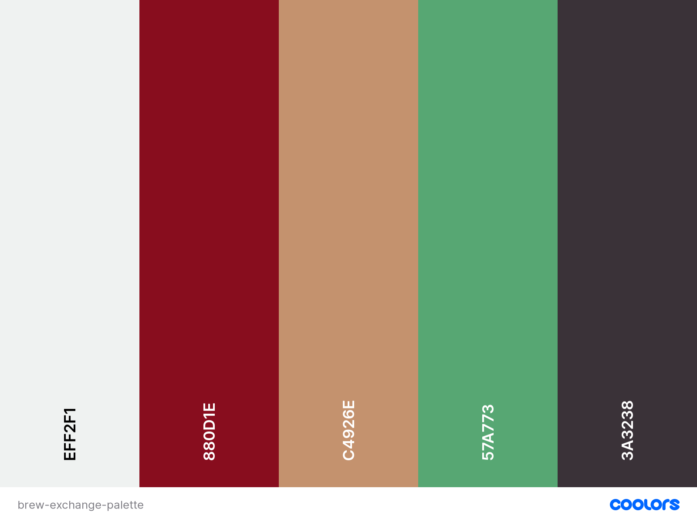

# Brew Exchange

[View the deployed site here.](https://ms3-brew-exchange.herokuapp.com/)

Brew Exchange is a website where users can share their coffee recipes with the specialty coffee community, and can access recipes from other members of the community. This website was created for submission as my Milestone Project 3 as part of the Diploma in Full Stack Software Development course with Code Institute.  
With a large variety of brewing equipment, coffee varieties, and brewing methods, users can search for recipes that suit the coffee or brewing equipment that they have. This site advances the ther user's goals by providing CRUD functionality to the coffee recipes database. It advances the site owner's goals by being a regular user of the site themselves.

[FINAL SITE MOCKUP]
 
## User Experience (UX)

The User Experience for this site was planned & developed using the [5 Planes of UX Design](https://medium.com/designcentered/ux-design-5-planes-method-b1b1d6587c05): Strategy, Scope, Structure, Skeleton, Surface.

### Strategy
#### User Stories

- As a first-time visitor, I want to:
    - See coffee recipes that other users have added.
    - Search for recipes by keywords.
    - Register an account to add my own recipes.

- As a returning visitor, I want to:
    - See coffee recipes added by other users.
    - Search for recipes by keyword.
    - Log in to my account to see receipes I have added.
    - Edit recipes that I have added.
    - Delete receipes that I have added.

- As the site owner, I want to:
    - Log in to my admin/superuser account.
    - Add brew method categories for users to choose from when creating recipes.
    - Edit brew method categories.
    - Delete brew method categories.

### Scope
#### Existing Features

- Hero Image with Lead Text:
    - The hero image serves the purpose of providing users with an immediate visual cue for the theme of the site - coffee. The Lead Text and call to action buttons concisely explain the site's purpose & demonstrate it's functionality.
- Search Functionality:
    - Allows users to search for specific types of recipes by keyword - available to both authenticated and unauthenticated users.
- Register:
    - Users can create an account on the site, in order to contribute to the site by adding their own coffee brewing recipes. The user input is validated, a new "user" document in the site's database is created, and hashing is used for password security.
- Login/Logout:
    - Adds authentication for registered users, allowing them to access, edit and delete their own recipes. Allows users to logout by clearing the "session" cookie.
- Profile:
    - Provides functionality for registered & logged in users to see the recipes that they've added (if any), add more recipes, edit or delete their existing recipes.
- Add Recipe:
    - Provides functionality for authenticated users to add their own recipes via a form.
- Edit Recipe:
    - Provides functionality for authenticated users to edit recipes that they've added. Extra checks are in place here to ensure the current user matches the username of the user who created the recipe.
- Delete Recipe:
    - Provides functionality for authenticated users to delete recipes that they've added. Extra authentication steps are also in place in this feature to ensure that the current username matches that of the recipe's creator.
- Admin/Superuser Registration:
    - This feature allows the site admin to register an account with the username "admin", granting access to edit and delete all recipes on the site for moderation purposes. The "admin" superuser is also granted access to additional site functionality to manage the brew methods that users can choose from when adding or editing recipes.
- Manage Brew Methods (ADMIN):
    - This section of the site allows the admin to view a list of the currently added brew methods, along with corresponding images of each brew method.
- Add Brew Methods (ADMIN):
    - Provides a form where the site admin can add new brew methods, and upload an image of the brew method.
    - It was decided to only allow images to be added in the form of an existing URL - due to the limitations for image support in the chosen database technology (MongoDB), and the additional development work that would be required to implement a third party image-to-URL solution. Because of these limitations, it was also decided to limit the use of images to the site admin only, to avoid misuse of the feature.
- Delete Brew Methods (ADMIN):
    - Provides functionality for the site admin to remove brew methods from the site.
- Contact Page:
    - Allows all users, authenticated or unauthenticated, to contact the site admin - for example, to ask the admin to add a new brew method to the list of options available in the "Add Recipe" form.

#### Future Planned Features
- Affiliate Links:
    - Would allow users to purchase brewing equipment of coffee beans used in specific recipes via affiliate links. Would additionally provide the admin/site owner with a means to generate income from the site via commissions.
- "Like" Buttons:
    - Would provide users with the option to "Like" recipes that they enjoy, and would save those recipes to a list that would be accessible from the user's Profile page.
- Image Upload for All Users:
    - Would provide an option for users to upload their own images to the site, to demonstrate how they would brew a particular recipe.

### Structure
#### Flowchart
- Flowchart created using [Lucidchart](https://www.lucidchart.com): 
    [Flowchart PNG](/readme-assets/images/brew-exchange-flowchart.png)

### Skeleton
#### Wireframes
- Wireframes created using [Balsamiq](https://balsamiq.com/): 
    [Wireframes PDF](/readme-assets/brew-exchange-wireframes.pdf)

### Surface

- Color Scheme:
    - Chosen using [coolors.co](https://coolors.co/). This palette was chosen to provide colors that tie in with the coffee theme of the site, and provide complimentary colors that offer sufficient contrasts to work with: 
    

- Typography:
    - The [Space Grotesk](https://fonts.google.com/specimen/Space+Grotesk) font was chosen for the site's headers, and [Poppins](https://fonts.google.com/specimen/Poppins) was chosen for the site's main text.

- Images:
    - [Unsplash](https://unsplash.com/) was used to select the site's Hero Image 
    

## Technologies Used

## Testing

### Testing User Stories from User Experience (UX) section

### Further Testing

## Deployment

## Credits

### Content
- CSS & JS for Sticky Navbar functionality adapted from [W3 Schools Example](https://www.w3schools.com/howto/howto_js_navbar_sticky.asp).

### Media

### Acknowledgements
